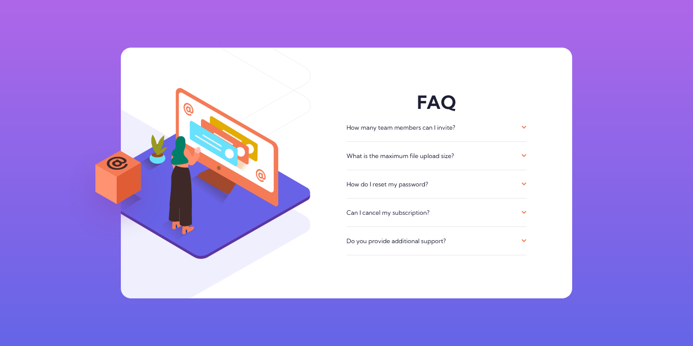

# Frontend Mentor - FAQ accordion card solution

This is a solution to the [FAQ accordion card challenge on Frontend Mentor](https://www.frontendmentor.io/challenges/faq-accordion-card-XlyjD0Oam). Frontend Mentor challenges help you improve your coding skills by building realistic projects.

## Table of contents

- [Overview](#overview)
  - [The challenge](#the-challenge)
  - [Screenshot](#screenshot)
  - [Links](#links)
- [My process](#my-process)
  - [Built with](#built-with)
  - [What I learned](#what-i-learned)
  - [Continued development](#continued-development)
  - [Useful resources](#useful-resources)
- [Author](#author)

## Overview

### The challenge

Users should be able to:

- View the optimal layout for the component depending on their device's screen size
- See hover states for all interactive elements on the page
- Hide/Show the answer to a question when the question is clicked

### Screenshot



### Links

- Solution URL: [Frontend Mentor solution URL](https://www.frontendmentor.io/solutions/faq-accordion-card-using-css-and-vanilla-js-8q6NhFFwX)
- Live Site URL: [Live site URL](https://juliflorezg.github.io/06_FAQ_accordion/)

## My process

### Built with

- Semantic HTML5 markup
- CSS custom properties
- Flexbox
- Mobile-first workflow
- Vanilla JavaScript

### What I learned

- Use of BEM CSS methodology for the accordion class naming
- Use of relative/absolute (and fixed) positioning
- Toggling and removing classes to DOM elements with JavaScript
- How to make reference to sibling & parent elements of an actual element
- Use of CSS to make the elements appear nice and smooth on screen

```html
<div class="accordion">
	<div class="accordion__title">
		<h2>FAQ</h2>
	</div>
	<div class="accordion__item">
		<div class="accordion__quote">
			<p class="accordion__question">How many team members can I invite?</p>
			
		</div>
		<div class="accordion__answer">
			<p>
				You can invite up to 2 additional users on the Free plan. There is no
				limit on team members for the Premium plan.
			</p>
		</div>
	</div>
</div>
```

```css
.accordion__icon {
	width: 10px;
	transition: all 0.2s linear;
}
.accordion__icon.show {
	transform: rotate(180deg);
	/* transition: all .2s linear; */
}

.accordion__answer {
	height: 0;
	overflow: hidden;
	transition: all 0.2s linear;
	padding-right: 12px;
	color: var(--dark-grayish-blue);
}

.accordion__answer.show {
	height: calc(var(--accordion-font-size) * 3 + 25px);
}
```

```js
document.addEventListener('click', e => {
	// Selects the question:
	if (e.target.matches('.accordion__question')) {
		console.log('button')

		// for each question element checks if it's the same which was clicked, when the element is NOT the same, this will remove the class show.
		//This allows to only have one question element open (so if I click on another question element the one which was open will close and the new one will be the only one opened).
		//The other effect of this is that we can close the same element by clicking the question element again (as previously it was only possible by opening another element and there was always one element opened)
		document.querySelectorAll('.accordion__question').forEach(question => {
			if (question !== e.target) {
				question.classList.remove('show')
			}
		})
		document.querySelectorAll('.accordion__icon').forEach(icon => {
			if (icon !== e.target.nextElementSibling) {
				icon.classList.remove('show')
			}
		})

		document.querySelectorAll('.accordion__answer').forEach(answer => {
			if (answer !== e.target.parentElement.nextElementSibling) {
				answer.classList.remove('show')
			}
		})
		e.target.classList.toggle('show')
		e.target.nextElementSibling.classList.toggle('show')
		e.target.parentElement.nextElementSibling.classList.toggle('show')
	}
}
```

### Continued development

- positioning of elements with CSS
- use of srcset HTML attribute and picture element for conditional image rendering (depending on viewport's size for example)
- accessing to DOM element's properties via JS and interacting with them

### Useful resources

- [Bootstrap Accordion page](https://getbootstrap.com/docs/5.0/components/accordion/) - This helped me for visualizing the accordion behavior by seeing the dev tools and checking which classes were added/removed.
- [Coder coder on YT](https://www.youtube.com/watch?v=FboXxLxg8eo) - This is a youtube video where coder coder builds the same project and explains her approach on taking this project. I'd recommend it to anyone who wants a helper guide on this one.

## Author

- Frontend Mentor - [@juliflorezg](https://www.frontendmentor.io/profile/juliflorezg)
- Linkedin - [Julian Florez](https://www.linkedin.com/in/julian-florez-585161153/)
